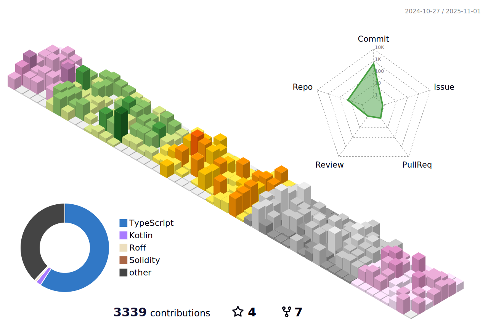

## About Me

I value **simplicity** and **efficiency** and avoid **over-architecting**.  
I prefer **simple, clear architecture** over unnecessary complexity and focus on making things more **maintainable** and **scalable**.  

I love **new technologies** and **new challenges**.  
I get a lot of excitement from trying things **I've never done before**, and I enjoy growing and improving my **problem-solving skills**.  
I also get a lot of satisfaction from **cleaning up** and **improving** existing **legacy systems**.  

Whether it's **refactoring legacy code** into a modern structure or **eliminating technical debt**, I'm motivated by the knowledge that I can contribute to the **long-term value** of a system.  
My goal is not just to write code that works,  
but to create systems that are **clean**, **easy to understand**, and **maintainable for the future**.  

I look forward to the opportunity to **work** and **grow** with you!  

## 🛠️ Tech Stack

**Languages**

**Frontend**

**Backend**

**Databases**

**DevOps & Tools**

## 📊 GitHub Stats

